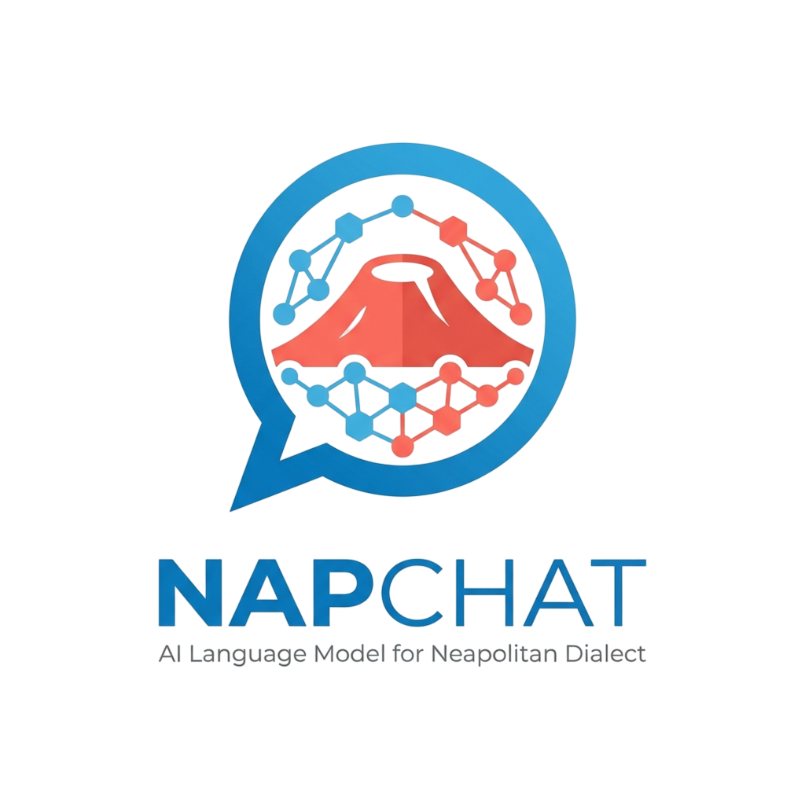
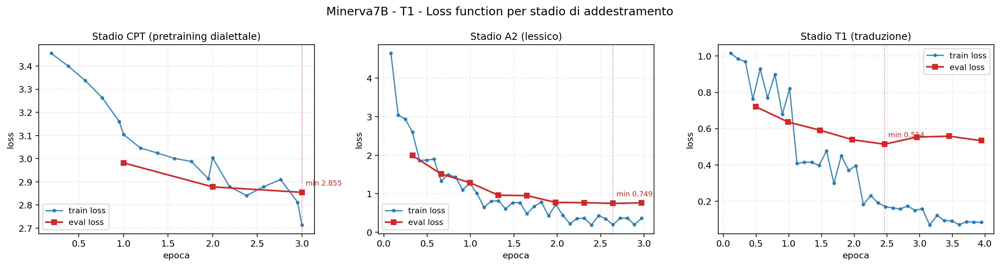
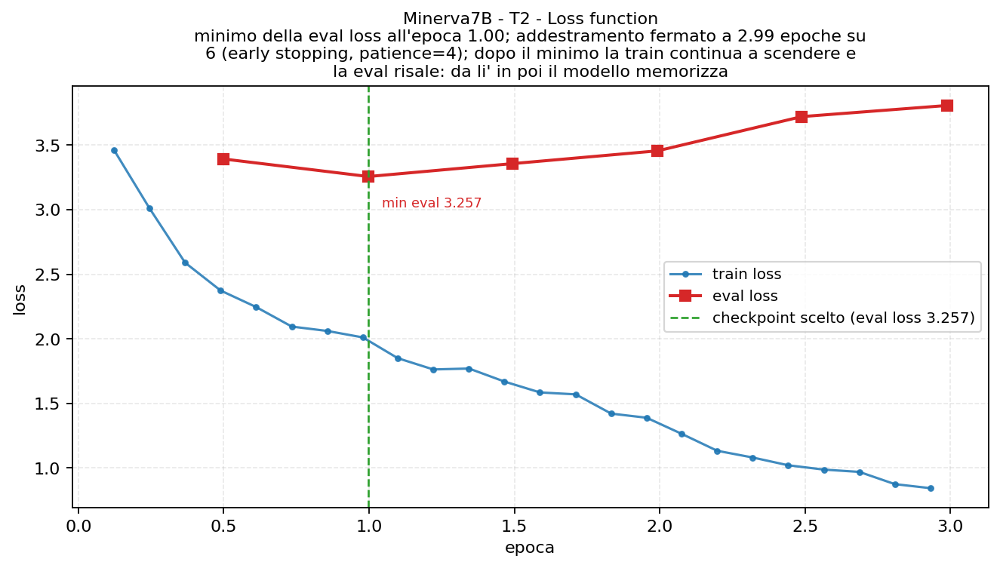
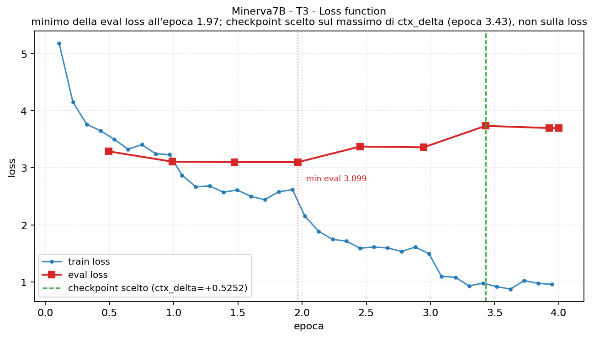
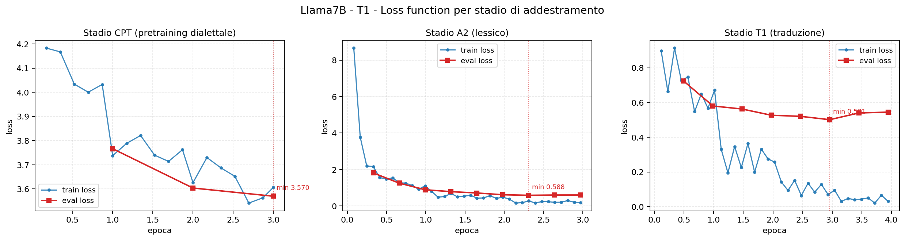
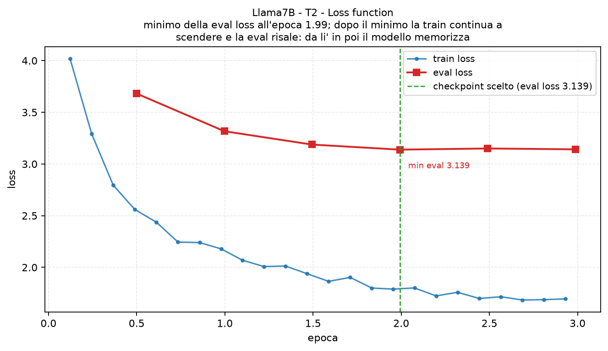
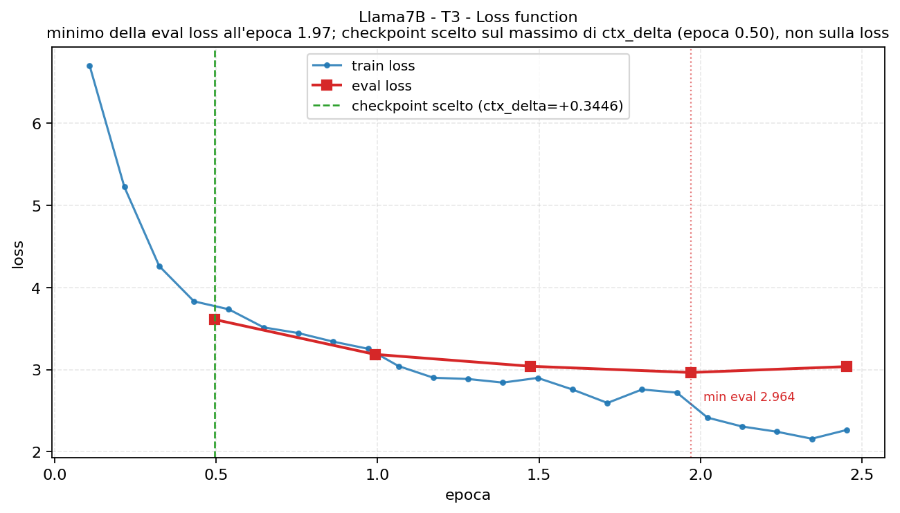
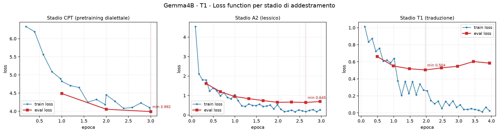
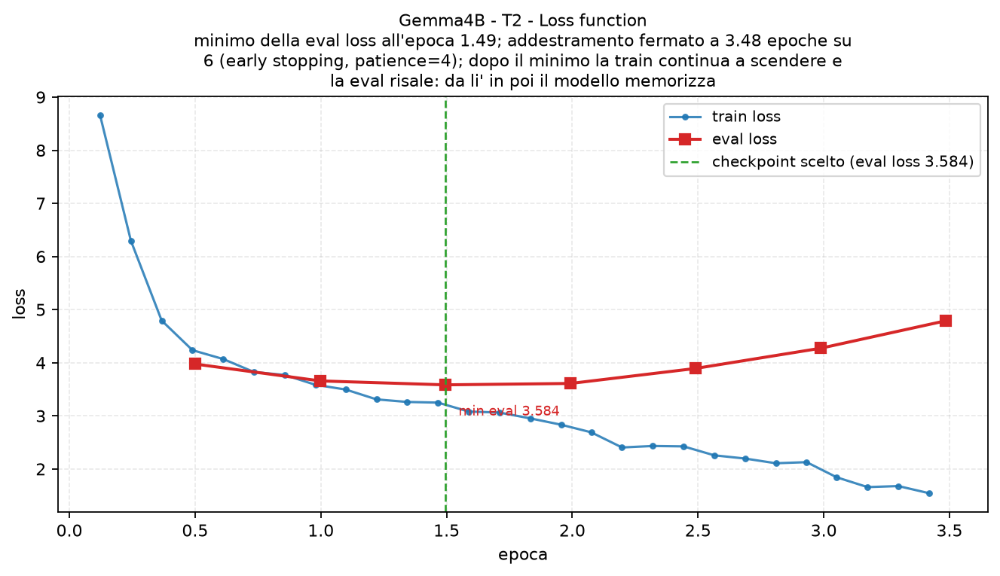
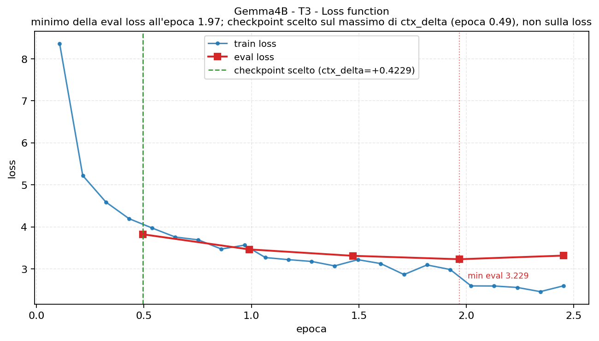

<p align="center">
  
</p>

# Fine-tuning e valutazione di Large Language Model per la generazione del dialetto napoletano: Traduzione, Completamento di Dialogo e Generazione libera a partire dal linguaggio parlato spontaneo

**Adattamento con LoRA/QLoRA, quantizzazione e confronto tra famiglie di modelli**

Fine-tuning QLoRA di tre LLM open su un corpus di parlato spontaneo tradotto in
napoletano, con valutazione automatica e valutazione umana su scala Likert.

## Di cosa si tratta

Due conversazioni del corpus **[KIPasti](https://github.com/KIParla/KIPasti)**
(parlato spontaneo italiano, 2.589 turni) sono state tradotte in napoletano con
un LLM e validate a mano da un parlante nativo. Sul dataset che ne esce sono stati fine-tunati **tre modelli su
tre task** — una matrice 3 × 3 con gli stessi dati, gli stessi split e gli stessi
iperparametri, così che le differenze siano attribuibili al modello.

| task | compito | train / dev / test |
|---|---|---|
| **T1** — traduzione con contesto | 3 turni napoletani di contesto + la frase italiana → resa napoletana | 1.134 / 270 / 267 |
| **T2** — completamento di turno | contesto + prima metà delle parole → seconda metà | 3.400 / 103 / 106 |
| **T3** — replica conversazionale | 6 turni di contesto → replica napoletana nuova | 742 / 165 / 168 |

L'addestramento è in tre stadi: **A** continued pretraining sul napoletano, **A2**
iniezione lessicale, **B** SFT sul task. A e A2 si eseguono una volta per modello
e servono tutti e tre i task.

Il corpus KIPasti è materiale di terzi e va ottenuto separatamente; il dataset
italiano–napoletano che ne deriva si ricostruisce con gli script della pipeline
(vedi *Script locali*).

### Come sono costruiti gli split

Lo split è **per posizione nella conversazione**, non casuale. Ogni
conversazione viene tagliata in tre blocchi contigui — 70 / 15 / 15 — separati da
una zona cuscinetto di 4 turni:

```
[-------- train --------][buf][-- dev --][buf][---- test ----]
```

Il cuscinetto serve a evitare che un turno di dev o di test compaia come
**contesto** di un esempio di train, che con task tutti condizionati sui turni
precedenti sarebbe una fuga di informazione silenziosa. Le proporzioni si
applicano a ciascuna conversazione separatamente, così entrambe contribuiscono a
tutti e tre i blocchi.

T2 e T3 non usano `split/` ma versioni ricostruite dagli stessi dati, senza
aggiungerne:

- **T2 (`split_v2/`)** — il taglio del turno diventa **mobile** invece che fisso a
  metà (altrimenti il modello impara «fermati dopo k parole», non «completa il
  turno»), la soglia minima di lunghezza scende da 6 a 4 parole, e i blocchi
  diventano interlacciati: con lo split cronologico dev e test cadevano
  nell'ultimo terzo di ogni conversazione, su argomenti mai visti in train
  (Jaccard delle parole di contenuto 0,10).
- **T3 (`split_t3/`)** — le finestre di contesto degli item consecutivi si
  sovrappongono, quindi la loro unione **ricostruisce la trascrizione**: 2.285
  turni contro i 1.127 usati come target. La finestra di contesto passa da 3 a 6
  turni.

Alla valutazione automatica (chrF++, BLEU, BERTScore, metriche lessicali,
pertinenza al contesto) si affianca una **valutazione umana Likert 1–5** di due
annotatori su naturalezza dialettale, accuratezza grammaticale e coerenza
lessicale ([likert/](likert/)).

## I modelli

| alias | repo Hugging Face | parametri | pesi fp16 | in VRAM a 4-bit | accesso |
|---|---|---|---|---|---|
| `minerva` | [`sapienzanlp/Minerva-7B-instruct-v1.0`](https://huggingface.co/sapienzanlp/Minerva-7B-instruct-v1.0) | ~7,4 B | ~15 GB | ~4,2 GB | pubblico |
| `llama` | [`meta-llama/Llama-2-7b-chat-hf`](https://huggingface.co/meta-llama/Llama-2-7b-chat-hf) | ~6,7 B | ~13,5 GB | ~3,9 GB | gated |
| `gemma` | [`google/gemma-3-4b-it`](https://huggingface.co/google/gemma-3-4b-it) | ~4,3 B | ~8,6 GB | ~3,4 GB | gated |

I valori in VRAM sono stime (parametri × ~0,55 byte per NF4 con double quant).
Llama-2 e Gemma sono *gated*: va accettata la licenza sull'Hub con lo stesso
account del token. Gli adapter LoRA prodotti pesano poche decine di MB.

## Risultati, modello per modello

Le curve sono generate da `scripts/grafici_metriche.py`. Come si leggono:

- **blu** = loss di training, **rosso** = loss di validazione; dove le due si
  separano il modello ha smesso di generalizzare e ha iniziato a memorizzare;
- **T1** ha tre pannelli, uno per stadio (pretraining dialettale, lessico, task);
- in **T3** la linea verde è il checkpoint scelto, che cade su un punto diverso
  dal minimo della loss (rosso): la selezione è su `ctx_delta` — quanto la
  risposta cambia al cambiare del contesto — perché la cross-entropy non sa
  insegnare la pertinenza.

Le metriche di riferimento: per T1 il **chrF++** su test, contro la baseline
«copia l'italiano senza tradurre» che vale **35,41**; per T2 la **perplessità
sul target** e la **ctx_accuracy**; per T3 il **ctx_delta**.

---

### Minerva7B — l'italiano nativo





| task | risultato | lettura |
|---|---|---|
| **T1** | chrF++ **71,05**, recall dialettale 0,79, lunghezza 0,99 | raddoppia la baseline e produce turni della lunghezza giusta |
| **T2** | perplessità 77 → **19,3**, ctx_accuracy 0,660 | la più bassa dei tre; partiva già dal punto migliore |
| **T3** | ctx_delta **2,38** (base 1,76, greedy 1,05) | l'unico che con il fine-tuning *guadagna* pertinenza |
| **Likert** | **3,42** su T2, **3,83** su T3 | l'unico giudicato sopra il 3 su entrambi i task |

Essere addestrato nativamente sull'italiano si vede: parte dalla perplessità più
bassa e resta il migliore sui due task generativi. La sua curva T2 è però anche
la più netta nel sovradattare — minimo di validazione già all'epoca 1 su 6, poi
risalita costante mentre la train scende fino a 0,8.

---

### Llama7B — il riferimento multilingua





| task | risultato | lettura |
|---|---|---|
| **T1** | chrF++ **36,90**, recall dialettale 0,38, lunghezza **0,45** | resta al livello della baseline: non traduce, tronca |
| **T2** | perplessità 222 → **21,1**, ctx_accuracy 0,689 | il task in cui se la cava meglio |
| **T3** | ctx_delta 1,95 con decodifica contestuale, ma **0,03** in greedy | fine-tunato e lasciato a sé, risponde di fatto a caso |
| **Likert** | 3,07 su T2, 2,70 su T3 | sotto Minerva su entrambi |

È il modello che parte da più lontano dal napoletano, e su T1 non colma il
divario: genera turni lunghi meno della metà del riferimento. Il dettaglio da
notare è che la sua curva T1 non lo dice — il minimo della eval loss (0,501) è
il migliore dei tre. È la generazione reale a smentirla.

---

### Gemma4B — il più piccolo dei tre





| task | risultato | lettura |
|---|---|---|
| **T1** | chrF++ **74,78**, recall dialettale 0,82, lunghezza 1,00 | il migliore dei tre, con 4 B contro 7 B |
| **T2** | perplessità **2.661 → 28,6**, ctx_accuracy 0,689, scelta@N 0,396 | il salto più grande: due ordini di grandezza |
| **T3** | ctx_delta 1,80 contestuale, ma il **base** faceva 2,20 | il fine-tuning gli fa *perdere* pertinenza |
| **Likert** | 2,69 su T2, 2,02 su T3 | il più debole per i giudici umani |

Due facce opposte. Sulla traduzione è il migliore pur essendo il più piccolo, e
partiva dalla perplessità più alta in assoluto: il fine-tuning è la differenza
fra non conoscere il napoletano e produrlo. In generazione libera invece 742
esempi bastano a erodere la capacità conversazionale che il modello base già
aveva — adattare al dialetto ha un costo.

---

### In sintesi

| | T1 (chrF++) | T2 (ctx_acc) | T3 (ctx_delta) | Likert T2 / T3 |
|---|---|---|---|---|
| **Minerva7B** | 71,05 | 0,660 | **2,38** | **3,42 / 3,83** |
| **Llama7B** | 36,90 | **0,689** | 1,95 | 3,07 / 2,70 |
| **Gemma4B** | **74,78** | **0,689** | 1,80 | 2,69 / 2,02 |
| *baseline / tetto* | *35,41 (copia)* | *~0,62 (zero-shot)* | — | *4,51 / 4,62 (turni umani)* |

Tre costanti attraversano i nove run:

1. **La loss non basta a scegliere il modello.** Su T1 i tre minimi di
   validazione sono indistinguibili (0,50–0,51) e i chrF++ vanno da 37 a 75.
2. **Con poche migliaia di esempi il sovradattamento arriva presto**: su T2 il
   minimo di validazione cade fra l'epoca 1 e la 2 su 6, e l'early stopping è
   ciò che tiene in piedi il risultato.
3. **La pertinenza al contesto va cercata in decodifica**, non solo in
   addestramento: fra greedy e decodifica contestuale il `ctx_delta` cambia di
   un ordine di grandezza.

L'accordo fra i due annotatori Likert è solido (α di Krippendorff 0,77–0,81), e
i turni umani presi dal corpus fissano il tetto realistico della scala: nemmeno
un parlante vero, trascritto da parlato spontaneo, prende punteggi pieni. Il
punteggio di Gemma va infine letto ricordando l'asimmetria di taglia dichiarata
fra gli arm del confronto: 4 B contro 7 B.

## Hardware necessario

**Una sola GPU da 16 GB basta.** Tutti i run sono stati fatti su una singola
**Tesla T4** (15,6 GB utilizzabili), quella del piano gratuito di Kaggle e
Colab. Anche quando Kaggle ne offre due, se ne usa una sola
(`CUDA_VISIBLE_DEVICES=0`): con `device_map={"":0}` la seconda resterebbe ferma
comunque. Su CPU gli script escono subito con un errore esplicito.

### Come ci si sta in 16 GB

| scelta | valore | perché |
|---|---|---|
| quantizzazione | **QLoRA 4-bit NF4** + double quant | un 7B in fp16 sono ~14 GB di soli pesi: non resterebbe spazio per attivazioni e ottimizzatore |
| adapter | LoRA r=16, α=32, dropout 0,05 su 7 moduli per layer | si addestra <1% dei parametri; il modello di base resta congelato |
| batch | 1–4 per device, `grad_accum` 4–16 | batch efficace 16 senza mai tenere in memoria più di 4 sequenze |
| lunghezza | `max_seq_len` 384–512 token | sotto 512 i target di T1 verrebbero troncati e la loss si calcolerebbe su un riferimento mutilato |
| memoria | gradient checkpointing attivo | ricalcola le attivazioni invece di conservarle |

### La precisione non è la stessa per tutti

La T4 è **compute capability 7.5**, pre-Ampere: **il bf16 non esiste in
hardware**. Attenzione al tranello: `torch.cuda.is_bf16_supported()` risponde
comunque `True` perché conta l'emulazione software, ed è il modo classico di
rendere il training molto più lento senza accorgersene. Gli script guardano la
*capability*, non quella funzione.

Da qui due strade diverse:

- **Llama7B e Minerva7B** girano in **fp16**, con i tensori non quantizzati
  riportati a fp32 come rete di sicurezza;
- **Gemma4B** gira in **fp32**. Gemma-3 ha attivazioni molto grandi: in fp16 il
  flusso residuale supera 65504, l'infinito entra nelle RMSNorm e i logit
  diventano NaN. L'effetto è insidioso perché non solleva eccezioni — `argmax`
  su NaN restituisce l'indice 0, che su Gemma è `<pad>`, quindi il modello emette
  solo pad, il testo decodificato è vuoto e **ogni metrica vale 0,00**. Il fp32
  costa circa il doppio del tempo, ed è il motivo per cui il run T2 di Gemma dura
  5 h 37 contro le 2 h 32 di Llama.

### Quanto tempo serve

Durate reali su T4. Lo stadio A (continued pretraining) è breve — 18 step su 3
epoche — e non incide; il grosso è A2 più il task.

| | Minerva7B | Llama7B | Gemma4B |
|---|---|---|---|
| stadio A2 (una volta per modello) | 1 h 18 | 1 h 28 | 2 h 20 |
| T1 | 1 h 04 | 1 h 01 | 1 h 46 |
| T2 | 2 h 18 | 2 h 32 | 5 h 37 |
| T3 | 1 h 48 | 0 h 58 | 1 h 57 |
| **totale per modello** | **~6 h 30** | **~6 h** | **~11 h 40** |

Sono circa **24 ore di solo addestramento**, che con lo stadio A, gli smoke test
e le valutazioni finali arrivano **nell'ordine delle 30 ore di T4**: la quota GPU
settimanale di Kaggle basta appena per una passata completa, quindi conviene
distribuire i run su più settimane oppure usare il resume da dataset montato
(vedi sotto).

### Su hardware migliore

Su GPU Ampere o successive (L4, A100) il bf16 è nativo: si passa a
`--precision bf16`, il fallback fp32 di Gemma non serve più e tutto è insieme
più veloce e numericamente più stabile. Con ≥ 24 GB si può anche alzare
`--batch-size` e ridurre `--grad-accum` a parità di batch efficace.

## Installazione

Il fine-tuning gira su Kaggle/Colab, dove `torch`, `transformers`, `numpy`,
`pandas`, `matplotlib`, `scikit-learn` e `scipy` sono già nell'immagine e **non
vanno reinstallati**: i notebook aggiungono da soli `peft`, `bitsandbytes`,
`accelerate`, `sacrebleu`, `rouge_score` e `bert-score`.

In locale servono solo gli script di pipeline dati, metriche e grafici — nessuna
GPU richiesta. Python 3.10–3.12:

```powershell
py -3.12 -m venv .venv
.venv\Scripts\activate
pip install -r requirements.txt
```

Su Windows, se serve anche la parte GPU, installa prima la ruota CUDA di
PyTorch da [pytorch.org](https://pytorch.org).

## Come far partire i notebook

Un notebook = **un modello × un task**. Le celle `%%writefile` scrivono i file
che trovi in `training/`: notebook e script del repo sono lo stesso codice.

**Su Kaggle** (T1 e T2, ambiente di riferimento):

1. *File > Import Notebook* → carica il notebook del task, es.
   [Gemma4B/T1_Traduzione/notebook/T1_fine-tuning.ipynb](Gemma4B/T1_Traduzione/notebook/T1_fine-tuning.ipynb).
2. *Settings > Accelerator*: `GPU P100` o `GPU T4 x2` — senza GPU gli script si
   fermano subito con un errore esplicito. *Internet: ON*.
3. *Add-ons > Secrets*: crea `HF_TOKEN` e spunta *Attach to notebook*.
4. *Add Data*: carica come Dataset la cartella dello split del task (`split/`
   per T1, `split_v2/` per T2, `split_t3/` per T3) e allegala al notebook.
5. Al **Passo 17** imposta `MODEL` (`"minerva"`, `"llama"`, `"gemma"`): è
   l'unica riga che cambia fra un notebook e l'altro.
6. Lancia lo **smoke test** (Passo 18, pochi minuti) e poi *Run All*, oppure
   *Save Version > Save & Run All* per il run lungo in background.

`/kaggle/working` viene azzerato fra le sessioni: per riprendere un run
interrotto, pubblica l'output precedente come Dataset e rilancia con
`--resume-dir /kaggle/input/<nome-dataset>`.

**Su Colab** (T3): il notebook rileva da solo l'ambiente e i percorsi. Serve
*Runtime > Cambia tipo di runtime > GPU*, `HF_TOKEN` nei *Secrets* e `split_t3/`
caricato. Scarica `runs/` ed `eval/` prima che la sessione scada.

**In locale**, con una GPU NVIDIA da ≥ 16 GB, gli script girano anche senza
notebook:

```bash
python pretrain_dialect.py       --model gemma --split-dir ./split                    # A
python finetune_a2_lessico.py    --model gemma --split-dir ./split \
    --init-adapter ./cpt/gemma-3-4b-it/adapter_final                                  # A2
python finetune_t1_traduzione.py --model gemma --split-dir ./split \
    --init-adapter ./runs/gemma-3-4b-it__A2/adapter_final                             # B
python evaluate_task.py --model gemma --task T1 --split-dir ./split \
    --adapter ./runs/gemma-3-4b-it__T1/adapter_final --split test --out ./eval
```

## Script locali (nessuna GPU)

```bash
# --kipasti punta alla copia locale del corpus KIPasti, da ottenere a parte
python scripts/build_conversation_dataset.py --kipasti ./dataset_Kipasti
python scripts/dialect_translate.py                  # richiede OLLAMA_KEY (env o file .api)
py -3.12 validation_gemma_golden/golden_consistency.py
py -3.12 dataset_finale/script/build_final_dataset.py

python scripts/grafici_metriche.py                   # grafici di T1, T2, T3
python likert/likert_human_eval.py analizza          # valutazione umana
```

## Struttura del repository

```
Minerva7B/ | Llama7B/ | Gemma4B/     una cartella per modello, identiche:
  <task>/notebook/    il notebook da eseguire
  <task>/training/    gli .py generati dal notebook
  <task>/split*/      dati pronti per l'addestramento
  <task>/runs/        summary.json: iperparametri, hardware, storia delle metriche
  <task>/eval*/       predizioni (.preds.jsonl) e metriche
  grafici_<modello>/  tutti i grafici del modello (loss, curve, confronti)
scripts/ golden_translate/ validation_gemma_golden/ dataset_finale/   pipeline dati
likert/                            valutazione umana: script, schede, risultati
```

## Licenze

Il codice di questo repository è materiale di un progetto universitario svolto
presso l'Università degli Studi di Salerno; la licenza d'uso è da definire.

Quello che il repository **non** può ridefinire, e che vincola chi riusa gli
adapter prodotti:

| componente | vincolo |
|---|---|
| `meta-llama/Llama-2-7b-chat-hf` | Llama 2 Community License: accesso *gated*, va accettata sull'Hub; si estende ai modelli derivati |
| `google/gemma-3-4b-it` | Gemma Terms of Use: accesso *gated*, con vincoli d'uso che seguono i derivati |
| `sapienzanlp/Minerva-7B-instruct-v1.0` | modello pubblico, si veda la licenza dichiarata sull'Hub |
| corpus KIPasti | materiale di terzi, soggetto ai termini di chi lo distribuisce |

Un adapter LoRA è un derivato del modello su cui è stato addestrato: eredita la
licenza di quel modello, non quella di questo repository.

---

Realizzato da **Chiara Puglia** e **Luca Giuliano**
Università degli Studi di Salerno
